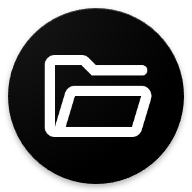

# docspace 📂

<p align="center">
  
</p>

<p align="center">
  <strong>Keep what matters. Save what's yours.</strong><br>
</p>

<p align="center">
  
  
  
</p>
<p align="center">
  
  
  
</p>
<p align="center">
  
  
</p>

<p align="center">
    <a href="https://github.com/xtractiion/docspace/releases/latest">
        
    </a>
    <a href="https://github.com/xtractiion/docspace/releases">
        
    </a>
    
    
</p>

## ✨ Features

### 🎨 Modern UI/UX
- **Dark Mode** - Deep black themes optimized for OLED screens.
- **Smooth Animations** - Fluid interactions powered by the `animations` package.
- **Custom Icons** - Aesthetic icons for every file type.

### 📂 Smart Organization
- **Subject-Based Folders** - Organize documents into subjects and projects.
- **Deep Nesting** - Create unlimited sub-folders for granular control.
- **Smart Grouping** - Visual organization of content for better readability.
- **Search** - Fast, local search implementation.

### ⚡ Seamless "Share to Save"
- **Instant Save** - Share PDFs/Images from WhatsApp, Telegram, or Drive directly to DocSpace.
- **One-Tap Action** - A dedicated "Save Here" mode that integrates with native intents.
- **Smart Handling** - Automatically handles Android intents to prevent duplicate apps in Recents.

### 🔒 Privacy & Performance
- **100% Offline** - No cloud syncing. Your files stay on your device.
- **No Tracking** - Privacy-first approach with zero analytics.
- **Split APKs** - Optimized build size (~16MB) for your specific device architecture.

##  Requirements

- **Android 7.0** (API 24) or higher
- **2GB RAM** recommended for smooth performance

---

## 🚀 Getting Started

### Prerequisites

- Flutter SDK 3.10+
- Android Studio 2023.1+
- Java 17

### Installation

1. **Clone the repository**
   ```sh
   git clone https://github.com/xtractiion/docspace.git
   ```

2. **Open in Terminal/VS Code**
   - Navigate to the directory
   ```sh
   cd docspace
   ```

3. **Get Dependencies**
   ```sh
   flutter pub get
   ```

4. **Run**
   - Connect a device
   ```sh
   flutter run --release
   ```

---

## ⬇️ Download

<p align="center">
  <a href="https://github.com/xtractiion/docspace/releases/latest">
    
  </a>
</p>

---

## 📂 Project Structure

```
lib/
├── models/         # Data models (Document, Subject)
├── providers/      # Riverpod providers (State Management)
├── screens/        # UI Screens (Home, Document List, etc.)
├── services/       # File & Storage services
├── utils/          # Helper functions
├── widgets/        # Reusable UI components
└── main.dart       # Entry point
```

---

## 🤝 Contributing

Contributions are welcome! Please feel free to submit a Pull Request.

1. Fork the Project
2. Create your Feature Branch (`git checkout -b feature/AmazingFeature`)
3. Commit your Changes (`git commit -m 'Add some AmazingFeature'`)
4. Push to the Branch (`git push origin feature/AmazingFeature`)
5. Open a Pull Request

---

## 📄 License

This project is distributed under the MIT License.

---

<p align="center">
  Made with ❤️ by <a href="https://github.com/xtractiion">xtractiion</a>
</p>
